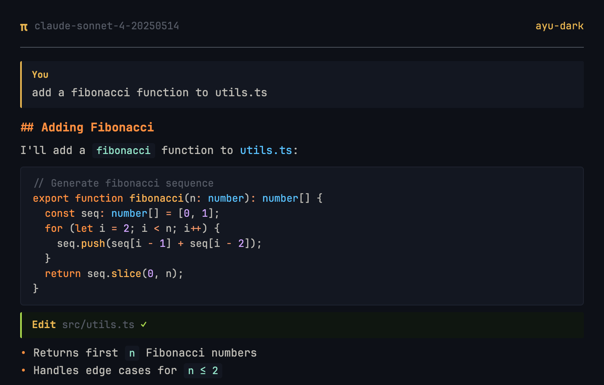
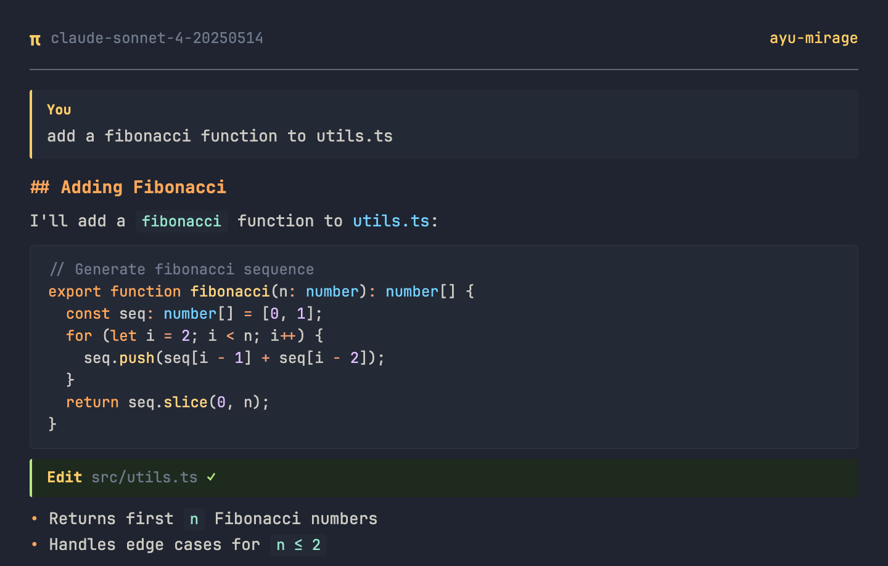
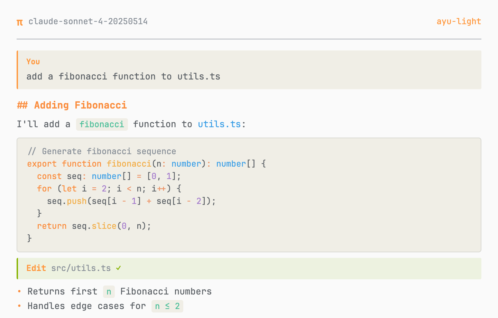

# @bacnh85/pi-themes

A collection of custom pi themes. Currently includes three Ayu-based color variants.

## Install

```bash
pi install npm:@bacnh85/pi-themes
```

Or for local development:

```bash
pi install ./pi-themes
```

Then select a theme via `/settings` in pi.

## Themes

| Theme | Background | Accent | Description |
|-------|-----------|--------|-------------|
| `pi-dark` | `#0D1017` | `#E6B450` | Ayu dark variant — deep blue-black |
| `pi-mirage` | `#171B24` | `#FFCC66` | Ayu mirage variant — soft dark blue |
| `pi-light` | `#FAFAFA` | `#FF9940` | Ayu light variant — warm white |

## Previews

### pi-dark



### pi-mirage



### pi-light



## Future Themes

This is a themes collection. Additional variants (e.g., solarized, nord, custom) will be added as new JSON files in this package.

## Attribution

Colors sourced from [ayu-colors](https://github.com/ayu-theme/ayu-colors). Initial pi theme port based on [iodic/pi-ayu-themes](https://github.com/iodic/pi-ayu-themes). Both projects are MIT-licensed.

## License

MIT
